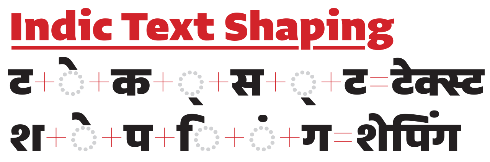

# Indic text shaping for type designers

_Draft for initial technical review_

梁海 (Liang Hai), independent researcher\
Peter Biľak, Typotheque

Typography occupies space at the intersection of linguistics, text rendering technologies, and design, and requires some knowledge of all of these areas. This document addresses how Indic (or Brahmic) scripts work, how the Unicode Standard encodes those scripts, what shaping behavior is expected for rendering, and how OpenType Layout (OTL) is utilized to implement the shaping behavior.

To start with, the nine Unicode ISCII scripts, especially the Devanagari script, are selected to drive the initial development of this document.

### Scope and intended audience

Encoded characters for Indic scripts change shape depending on their context. This document is intended for type designers who have designed Devanagari typefaces and wish to turn them into functional fonts. It is also relevant for type users that wish to understand the expected behavior of how text shaping engines process Indic text.

The intention of this document is to present a tool-independent explanation of the logic and techniques of turning encoded Indic letters and diacritics into rendered text. Hopefully it will allow to understand the techniques and allow type designers to produce fonts in the tool of their choice. The documentation of expected Indic text shaping can be useful for general type users to see if the combination of fonts and text shaping engines they use delivers correct results.

This documentation does not contain instructions how to draw and construct glyphs of Devanagari or other scripts. Linguistic evaluation of Hindi and other languages, such as grammar and orthography, is also outside of the scope of this project, as we look solely at understanding of text representation and rendering of written languages.

### Documentation

1\. [Unicode text](docs/1-Unicode.md)\
2\. [OTL text shaping](docs/2-OTL.md)\
3\. [Orthography-specific shaping requirements](docs/3-orthographies.md)

### Appendix

A. [Tutorial on how to build an OTL Devanagari font](docs/A-tutorial.md)\
B. [About glyphs](docs/B-glyphs.md)

### Feedback

The authors will be happy to review feedback and suggestions how to improve this documentation, and we encourage users to [open an issue on GitHub](https://github.com/typotheque/text-shaping/issues). Due to time constrains, however, the authors are unable to help with the production of specific fonts, so if you have such questions, raise them on a public forum such as [TypeDrawers](https://typedrawers.com).
